# Exploratory Data Analysis

[<< Go back](../README.md)
## Feature : target
- **Feature type** : discrete
- **Missing** : 0.0%
- **Unique** : 2
- **Count** :6455.0
- **Mean** :0.4912470952749806
- **Std** :0.49996210902027555
- **Min** :0.0
- **25%th Percentile** : 0.0
- **50%th Percentile** : 0.0
- **75%th Percentile** : 1.0
- **Max** :1.0

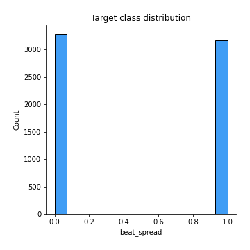
## Feature : Unnamed: 0
- **Feature type** : discrete
- **Missing** : 0.0%
- **Unique** : 82
- **Count** :6455.0
- **Mean** :39.314949651433
- **Std** :23.079908302216246
- **Min** :0.0
- **25%th Percentile** : 19.0
- **50%th Percentile** : 39.0
- **75%th Percentile** : 59.0
- **Max** :81.0

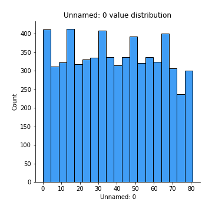
## Feature : win_percentage_5
- **Feature type** : continous
- **Missing** : 0.0%
- **Unique** : 190
- **Count** :6455.0
- **Mean** :0.17758683341738096
- **Std** :0.1849726706354103
- **Min** :0.0
- **25%th Percentile** : 0.0612244897959183
- **50%th Percentile** : 0.1176470588235294
- **75%th Percentile** : 0.2222222222222222
- **Max** :1.0

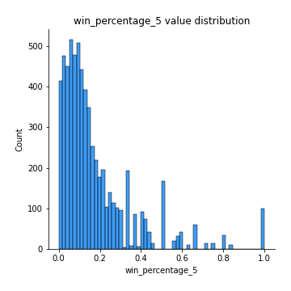
## Feature : win_percentage
- **Feature type** : continous
- **Missing** : 0.0%
- **Unique** : 1146
- **Count** :6455.0
- **Mean** :0.503906170255755
- **Std** :0.17317376542182794
- **Min** :0.0
- **25%th Percentile** : 0.3945515196441808
- **50%th Percentile** : 0.5
- **75%th Percentile** : 0.6111111111111112
- **Max** :1.0

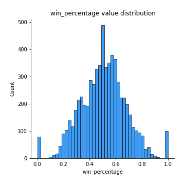
## Feature : avg_margin_5
- **Feature type** : continous
- **Missing** : 0.0%
- **Unique** : 5739
- **Count** :6455.0
- **Mean** :0.7385353388504462
- **Std** :3.5140218695090852
- **Min** :-29.666666666666668
- **25%th Percentile** : -0.3272943722943715
- **50%th Percentile** : -0.0075987841945277
- **75%th Percentile** : 0.4201275917065396
- **Max** :48.0

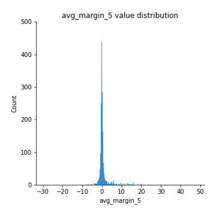
## Feature : avg_margin
- **Feature type** : continous
- **Missing** : 0.0%
- **Unique** : 3744
- **Count** :6455.0
- **Mean** :11.619403915160696
- **Std** :2.315716521529243
- **Min** :1.0
- **25%th Percentile** : 10.383156028368795
- **50%th Percentile** : 11.422535211267606
- **75%th Percentile** : 12.674456521739131
- **Max** :48.0

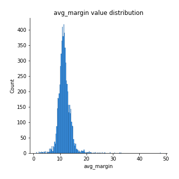
## Feature : home_or_away
- **Feature type** : discrete
- **Missing** : 0.0%
- **Unique** : 2
- **Count** :6455.0
- **Mean** :0.5031758326878388
- **Std** :0.5000286473711315
- **Min** :0.0
- **25%th Percentile** : 0.0
- **50%th Percentile** : 1.0
- **75%th Percentile** : 1.0
- **Max** :1.0

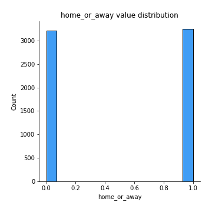
## Feature : spread
- **Feature type** : continous
- **Missing** : 0.0%
- **Unique** : 76
- **Count** :6455.0
- **Mean** :-0.06452362509682416
- **Std** :7.029712229535551
- **Min** :-21.0
- **25%th Percentile** : -5.5
- **50%th Percentile** : -1.0
- **75%th Percentile** : 5.5
- **Max** :21.0

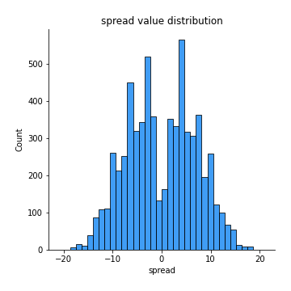
## Feature : opp_win_percentage_5
- **Feature type** : continous
- **Missing** : 0.0%
- **Unique** : 192
- **Count** :6455.0
- **Mean** :0.17396122365396402
- **Std** :0.17980341420255236
- **Min** :0.0
- **25%th Percentile** : 0.0606060606060606
- **50%th Percentile** : 0.1176470588235294
- **75%th Percentile** : 0.2222222222222222
- **Max** :1.0

## Feature : opp_win_percentage
- **Feature type** : continous
- **Missing** : 0.0%
- **Unique** : 1086
- **Count** :6455.0
- **Mean** :0.49919407030208823
- **Std** :0.17209759545362618
- **Min** :0.0
- **25%th Percentile** : 0.391304347826087
- **50%th Percentile** : 0.5
- **75%th Percentile** : 0.6046511627906976
- **Max** :1.0

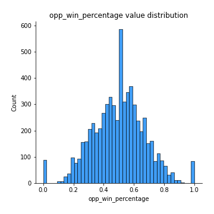
## Feature : opp_avg_margin_5
- **Feature type** : continous
- **Missing** : 0.0%
- **Unique** : 4567
- **Count** :6455.0
- **Mean** :0.7504478471651627
- **Std** :3.5366757100521107
- **Min** :-33.5
- **25%th Percentile** : -0.3229610272293195
- **50%th Percentile** : -0.0105042016806713
- **75%th Percentile** : 0.4167645906776354
- **Max** :48.0

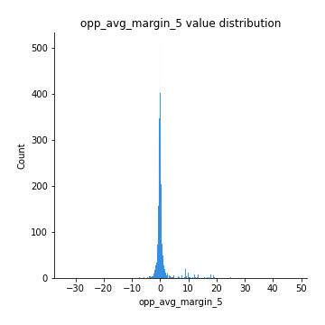
## Feature : opp_avg_margin
- **Feature type** : continous
- **Missing** : 0.0%
- **Unique** : 3157
- **Count** :6455.0
- **Mean** :11.662209011657927
- **Std** :2.2710565464495986
- **Min** :1.0
- **25%th Percentile** : 10.445299145299145
- **50%th Percentile** : 11.478260869565217
- **75%th Percentile** : 12.709005376344086
- **Max** :48.0

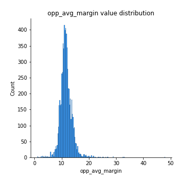

[<< Go back](../README.md)
