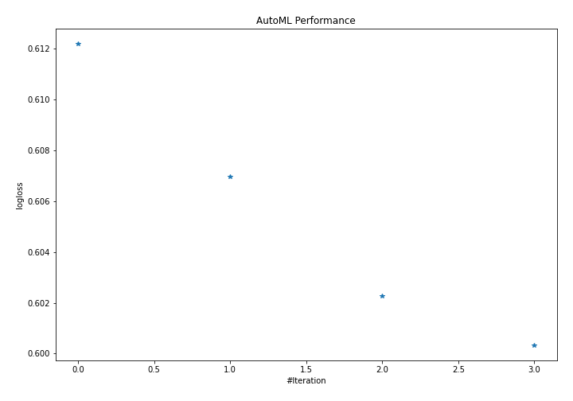
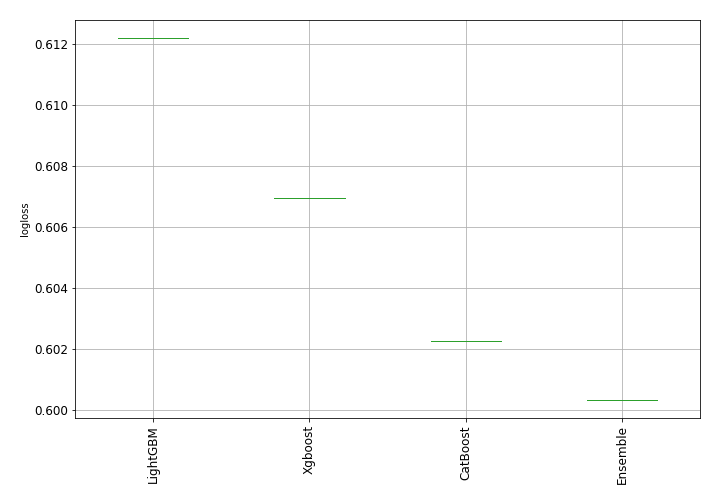
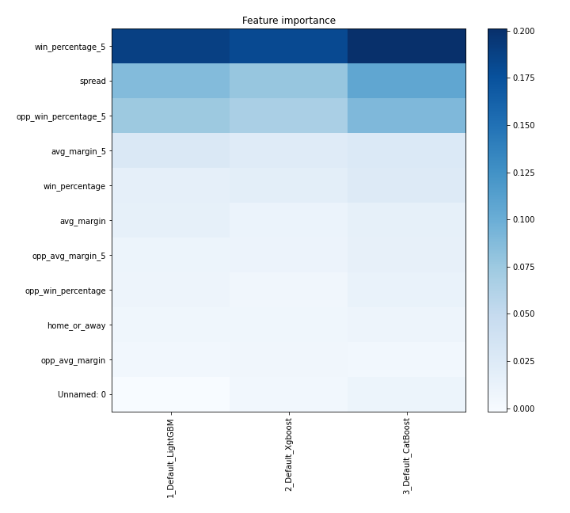
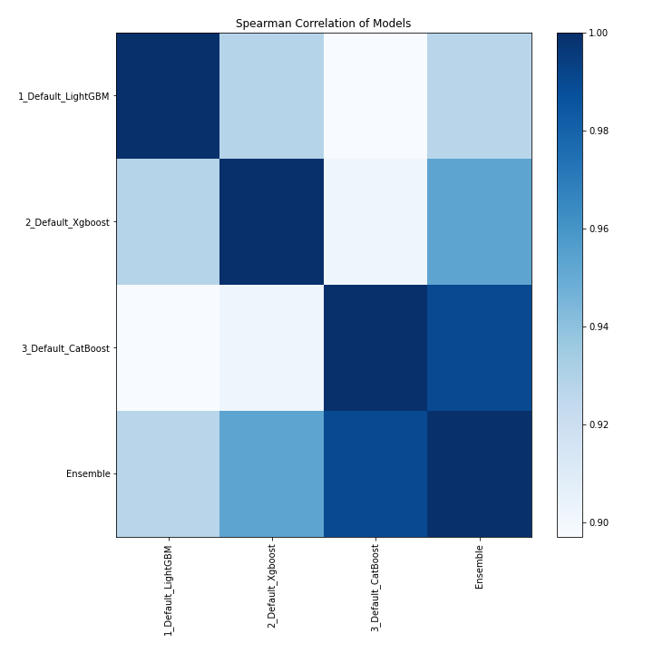

# AutoML Leaderboard

| Best model   | name                                               | model_type   | metric_type   |   metric_value |   train_time |
|:-------------|:---------------------------------------------------|:-------------|:--------------|---------------:|-------------:|
|              | [1_Default_LightGBM](1_Default_LightGBM/README.md) | LightGBM     | logloss       |       0.612197 |        12.13 |
|              | [2_Default_Xgboost](2_Default_Xgboost/README.md)   | Xgboost      | logloss       |       0.606966 |         7.32 |
|              | [3_Default_CatBoost](3_Default_CatBoost/README.md) | CatBoost     | logloss       |       0.602261 |         2.3  |
| **the best** | [Ensemble](Ensemble/README.md)                     | Ensemble     | logloss       |       0.600326 |         0.7  |

### AutoML Performance

### AutoML Performance Boxplot

### Features Importance

### Spearman Correlation of Models

