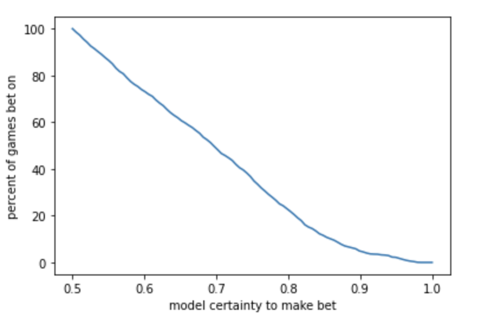

# NBA Spread Prediction
## Predicting if NBA Teams will beat the spread

In this project I created a Light GBM based machine learning model that predicted if an NBA team would beat the spread with 70% accuracy. I scraped NBA box score and spread data from the Oddshark website for NBA seasons from 2018 - 2022, and then engineered features and did model selection. The models I considered were Light GBM, Random Forest Classifiers, a 1 Layer NN, and a Linear SVC. 

After I decided on the LightGBM model and trained it with K-Folds cross validation on NBA data from 2018-2021, I created an optimal betting strategy to use for the 2022 season. If the model starts with $100 and bets $50 on each game it has a 53% certainty in, the model can generate over $20,000 in winnings.

### Alternate Betting Strategy 
Setting the certainty threshold to 0.53 does result in the most cash generated, but this is largely because it results in the most games being bet on (97%). Very few people have the energy to bet on 97% of games in an NBA season. A certainty threshold of 0.91 maximizes the money made per bet ($100), although the model is only this certain of 6% of all NBA games.

### Features
The features I constructed were the team's winning ratio, their winning ratio in the last 5 games, their average margin of victory, their average margin of victory in the last 5 games, the same quantities for their oppponent, whether the game was being played at home or away, and what the spread was.

### Analyzing the Certainty Threshold
The following graphs show interesting, if not expected, results that arise from experimenting with the model's certainty threshold. One unexpected result is that the model is often less confident than it should be; it's certainty is prediction is lower than its accuracy.

